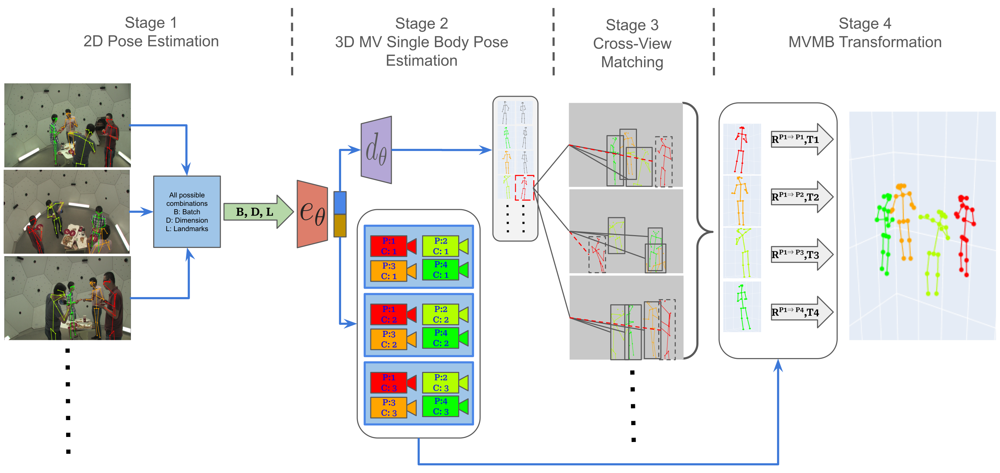

# MVMB-NRSFM
Code for Deep NRSFM for Multi-view Multi-body Pose Estimation.

This paper addresses the challenging task of unsupervised relative human pose estimation. Our solution exploits the potential offered by utilizing multiple uncalibrated cameras. It is assumed that spatial human pose and camera parameter estimation can be solved as a block sparse dictionary learning problem with zero supervision. The resulting structures and camera parameters can fit individual skeletons into a common space. To do so, we exploit the fact that all individuals in the image are viewed from the same camera viewpoint, thus exploiting the information provided by multiple camera views and overcoming the lack of information on camera parameters. To the best of our knowledge, this is the first solution that requires neither 3D ground truth nor knowledge of the intrinsic or extrinsic camera parameters. Our approach demonstrates the potential of using multiple viewpoints to solve challenging computer vision problems. Additionally, we provide access to the code, encouraging further development and experimentation

## Pipeline
 

## Update
The project will be archived as a new version is coming soon.
[Realtime MVMB Deep NRSFM repository](https://github.com/Jeryoss/realtime-mvmb-deep-nrsfm).


## Installation
### Using Apptainer
1. Build the container:
   - apptainer build --fakeroot nrsfm.sif nrsfm.def
2. Run the container:
   - apptainer exec nrsfm.sif bash

### Using conda environment
1. Clone this repo and navigate to MVMB-NRSFM folder.
2. Run the installation script:
   - bash installation.sh

## Citation

```bibtex
@article{fothi2024deep,
  title={Deep NRSFM for multi-view multi-body pose estimation},
  author={F{\'o}thi, {\'A}ron and Skaf, Joul and Lu, Fengjiao and Fenech, Kristian},
  journal={Pattern Recognition Letters},
  volume={185},
  pages={218--224},
  year={2024},
  publisher={Elsevier}
}
```